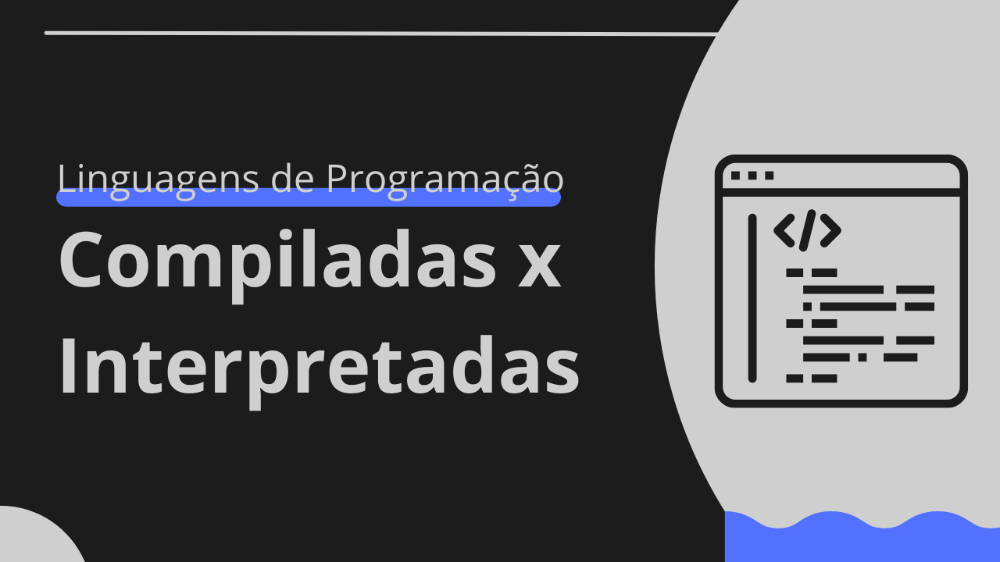

# Linguagens de Programação Compiladas x Interpretadas: quais as diferenças?

Diferentes linguagens de programação são executadas de maneiras distintas, sabia? Isso porque passam por métodos de tradução que convertem o código-fonte, escrito pelo desenvolvedor em uma linguagem de programação, em códigos que o computador consiga executar.

Dentre os métodos de tradução, destacam-se a Compilação e a Interpretação. Mas afinal de contas, o que é um compilador e um interpretador?

### Compilador

* O compilador pode ser definido como um programa que traduz todo o código escrito em uma linguagem de programação (código-fonte) em um código de máquina, gerando arquivos adicionais que consigam ser executados pelo computador.

### Interpretador

* O interpretador, ao contrário do compilador, NÃO traduz o código-fonte inteiro para depois executá-lo, já que essa conversão ocorre simultaneamente à execução do código, deixando de lado a necessidade da criação de arquivos adicionais em código de máquina para serem executados posteriormente.

## Linguagens Compiladas

Como dito anteriormente, as linguagens de programação compiladas (C ou C++, por exemplo), como o próprio nome já diz, necessitam de *compiladores que convertam TODO o código-fonte em arquivos executáveis específicos para o sistema operacional* (SO) em que foi desenvolvido.

Devido a isso, em certos casos, pode haver a necessidade de uma adaptação do código-fonte para que possa ser executado em SO diferentes, o que pode ser uma desvantagem quando comparado às linguagens interpretadas, que raramente precisam ser modificadas para rodar em sistemas operacionais distintos.

No entanto, após ser compilado, o programa pode ser executado de forma muito rápida, principalmente quando comparado com o mesmo programa escrito em uma linguagem interpretada, já que foi completamente convertido em linguagem de máquina previamente.

## Linguagens Interpretadas

Diferentemente das linguagens compiladas, os códigos escritos em linguagens de programação interpretadas (Javascript e PHP, por exemplo) NÃO necessitam de arquivos executáveis totalmente gerados previamente para serem executados.

Isso porque a *interpretação do código-fonte ocorre de maneira gradual*, sendo que cada sistema operacional possui um interpretador específico para a sua plataforma, responsável por ler o programa escrito pelo desenvolvedor e traduzi-lo por partes para os códigos de máquina.

Por ser uma tradução realizada em etapas, a execução de códigos desenvolvidos em linguagens interpretadas é, na maioria das vezes, mais lenta quando comparada a execução do mesmo programa desenvolvido em uma linguagem compilada. 

Uma de suas vantagens, entretanto, é que os códigos-fonte raramente precisam ser adaptados para rodarem em SO distintos, já que cada plataforma possui o seu próprio interpretador, possibilitando a execução de um mesmo programa em diferentes sistemas operacionais.

## Linguagens JIT - Pré-compiladas

As linguagens de programação pré-compiladas (C# e Java, por exemplo), são baseadas no conceito de compilação *Just-in-Time* (JIT), que basicamente une os “poderes” dos dois modos de tradução: a compilação e a interpretação.

Em linguagens JIT, o código-fonte é compilado e convertido, caso possua uma sintaxe correta, em uma linguagem de programação intermediária (Common Intermediate Language - CIL), chamado de **Bytecode**, que pode ser executado em diferentes plataformas, por se tratar de uma linguagem intermediária entre o código-fonte e o código de máquina.

Por fim, vale lembrar que o **Bytecode necessita de uma máquina virtual no sistema operacional**, responsável por convertê-lo em códigos que possam ser interpretados pelo computador e finalmente executados, tarefa que pode ser comparada a de um interpretador.

---
### Referências:

[Métodos de tradução: interpretador x compilador](https://blog.geekhunter.com.br/metodos-de-traducao-compiladores-ou-interpretadores/)

[O que é Compilador?](https://celsokitamura.com.br/o-que-e-compilador/)
